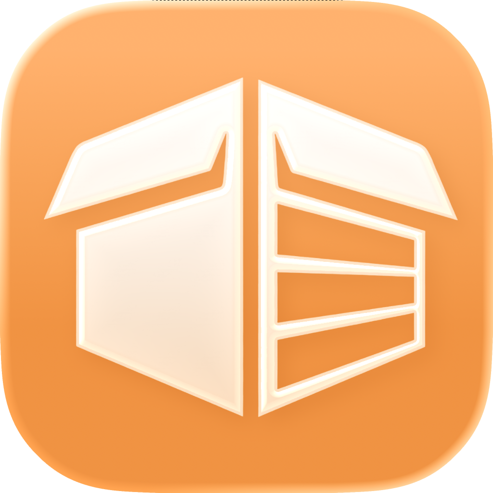
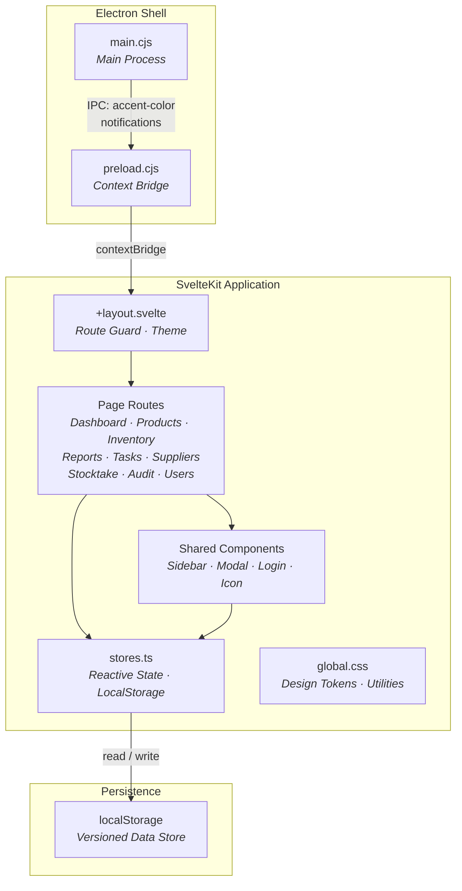

<p align="center">
  
</p>

<p align="center">
  
  
  
  
  
</p>

# PolyWMS

**A modern, offline-first Warehouse Management System built with SvelteKit and Electron.**

PolyWMS delivers a native desktop experience with a premium Apple-inspired UI — featuring translucent sidebars, dynamic OS accent color syncing, and smooth micro-animations — while providing robust warehouse operations including inventory tracking, stock auditing, task assignment, and real-time reporting.

---

## Table of Contents

- [Introduction](#introduction)
- [Key Features](#key-features)
- [Architecture](#architecture)
- [Getting Started](#getting-started)
  - [Prerequisites](#prerequisites)
  - [Installation](#installation)
  - [Running the Project](#running-the-project)
- [Environment Configuration](#environment-configuration)
- [Folder Structure](#folder-structure)
- [Contributing](#contributing)
- [Roadmap](#roadmap)
- [License](#license)

---

## Introduction

Managing warehouse operations shouldn't require expensive enterprise software or constant internet connectivity. **PolyWMS** is a lightweight, offline-first desktop application designed for small-to-medium warehouse teams who need reliable inventory management without cloud dependencies.

Built on **SvelteKit** (Svelte 5 Runes) for blazing-fast reactivity and **Electron** for native OS integration, PolyWMS runs on both **macOS** and **Windows** as a first-class desktop citizen.

### Who is this for?

| Role | What they get |
|------|-------------|
| **Warehouse Staff** | Simple product lookup, stock-in/stock-out, and task tracking |
| **Managers** | Real-time dashboards, reporting with CSV export, and task assignment |
| **Administrators** | Full user management, audit logs, and role-based access control |

---

## Key Features

### 🔐 Role-Based Access Control (RBAC)
Three distinct roles — **Admin**, **Manager**, **Staff** — with granular route-level guards. Unauthorized navigation is automatically redirected.

### 📦 Inventory Management
Complete stock-in and stock-out workflows with real-time quantity tracking. Every transaction is timestamped and attributed to the user who performed it.

### 📊 Reports & Analytics
Interactive bar charts showing import/export trends. Filter transactions by date range, type, or product. Export everything to **CSV** with one click.

### ✅ Task Assignment
Managers can assign, prioritize, and track tasks for warehouse staff. Tasks flow through `Pending → In Progress → Done` with full audit trails.

### 🏭 Stocktake
Periodic physical inventory counts with automatic discrepancy detection between recorded and actual stock levels.

### 📋 Audit Trail
Dual-purpose logging system capturing both administrative actions and warehouse transactions for complete operational transparency.

### 🎨 Apple-Native Design System
A premium "Tahoe Liquid Glass" UI with:
- Translucent acrylic sidebar with `backdrop-filter` blur
- Dynamic accent color synced from macOS/Windows system preferences via Electron IPC
- SF Pro typography and SF Symbol-style SVG icons
- Smooth spring-based animations

### 🔌 Offline-First
All data persists locally via `localStorage` with a versioned migration system. No server, no database setup, no internet required.

---

## Architecture



### Tech Stack

| Layer | Technology | Purpose |
|-------|-----------|---------|
| **UI Framework** | SvelteKit + Svelte 5 Runes | Reactive rendering with fine-grained reactivity |
| **Desktop Runtime** | Electron 33 | Native window management, OS integration |
| **Build Tool** | Vite 7 | Lightning-fast HMR and static builds |
| **Styling** | Vanilla CSS | Custom Apple HIG design system — no frameworks |
| **Type Safety** | TypeScript 5 | End-to-end type coverage |
| **Data Layer** | localStorage | Offline-first persistent state via `persistentWritable` |

---

## Getting Started

### Prerequisites

- **Node.js** ≥ 18.x ([Download](https://nodejs.org/))
- **npm** ≥ 9.x (bundled with Node.js)
- **Git** ([Download](https://git-scm.com/))

### Installation

```bash
# Clone the repository
git clone git@github.com:Ic0u/PolyWMS.git
cd PolyWMS

# Install dependencies
npm install
```

### Running the Project

PolyWMS supports two development modes:

#### Browser Mode (Web Development)

```bash
npm run dev
```

Opens at [http://localhost:5173](http://localhost:5173). Best for rapid UI iteration with Vite HMR.

#### Desktop Mode (Electron)

```bash
npm run electron
```

Launches the full native desktop experience. Vite dev server starts first, then Electron connects to it automatically.

#### Production Build

```bash
# Build static assets
npm run build

# Build distributable .dmg (macOS) or .exe (Windows)
npm run electron:build
```

### Type Checking

```bash
# One-time check
npm run check

# Watch mode
npm run check:watch
```

---

## Environment Configuration

PolyWMS is designed to work **out of the box** with zero configuration. All data is stored locally in the browser's `localStorage`.

| Variable | Default | Description |
|----------|---------|-------------|
| `STORE_VERSION` | `'5'` | Internal schema version for localStorage migrations. Incrementing this resets persisted data. |

> **Note:** Environment variables (`.env`) are not required for local development. The `.env` file is gitignored for future use cases (e.g., Supabase/Firebase integration).

### Electron Configuration

The Electron build configuration is defined directly in `package.json`:

```jsonc
{
  "build": {
    "appId": "com.poly.app",
    "productName": "Poly",
    "mac": { "target": ["dmg"] },
    "win": { "target": ["nsis"] }
  }
}
```

---

## Folder Structure

```text
PolyWMS/
├── docs/                          # Project documentation
│   ├── BACKLOG_COVERAGE.md        #   Agile backlog audit report
│   └── PROJECT_REVIEW_260320.md   #   Technical review document
│
├── electron/                      # Electron main process
│   ├── main.cjs                   #   Window creation, IPC handlers, accent color detection
│   └── preload.cjs                #   Secure context bridge (contextIsolation)
│
├── src/
│   ├── lib/
│   │   ├── components/            # Reusable Svelte components
│   │   │   ├── Icon.svelte        #   SF Symbol-style SVG icon library
│   │   │   ├── Login.svelte       #   Authentication screen
│   │   │   ├── Modal.svelte       #   Reusable modal dialog
│   │   │   └── Sidebar.svelte     #   Navigation sidebar with acrylic blur
│   │   │
│   │   ├── styles/
│   │   │   └── global.css         #   Design tokens, utilities, Tahoe Glass system
│   │   │
│   │   └── stores.ts              #   Reactive stores, data models, persistence layer
│   │
│   ├── routes/                    # SvelteKit file-based routing
│   │   ├── +layout.svelte         #   Root layout, route guard, theme provider
│   │   ├── +page.svelte           #   Dashboard (overview, stats, charts)
│   │   ├── audit/                 #   System audit log viewer
│   │   ├── inventory/             #   Stock-in / Stock-out operations
│   │   ├── products/              #   Product catalog (CRUD + category filter)
│   │   ├── reports/               #   Analytics, charts, CSV export
│   │   ├── stocktake/             #   Physical inventory counting
│   │   ├── suppliers/             #   Supplier management
│   │   ├── tasks/                 #   Task assignment & tracking
│   │   └── users/                 #   User management (Admin only)
│   │
│   ├── app.html                   #   HTML shell
│   └── app.d.ts                   #   Global type declarations
│
├── static/                        # Static assets (avatars, fonts, images)
│   └── fonts/                     #   SF Pro Display & Text fonts
│
├── package.json                   #   Dependencies & scripts
├── svelte.config.js               #   SvelteKit + adapter-static config
├── tsconfig.json                  #   TypeScript configuration
└── vite.config.ts                 #   Vite build configuration
```

---

## Contributing

We welcome contributions! Here's how to get started:

### 1. Fork & Clone

```bash
git clone git@github.com:YOUR_USERNAME/PolyWMS.git
cd PolyWMS
npm install
```

### 2. Create a Branch

```bash
git checkout -b feature/your-feature-name
```

### 3. Development Guidelines

- **Components:** Place reusable components in `src/lib/components/`. Use Svelte 5 Runes (`$state`, `$derived`, `$effect`).
- **Styling:** Use CSS custom properties from `global.css`. Avoid inline styles and CSS frameworks.
- **State:** Add new persistent stores via `persistentWritable()` in `stores.ts`. Bump `STORE_VERSION` if changing data schemas.
- **Icons:** Add new icons to `Icon.svelte` following the existing SF Symbol SVG pattern.
- **Types:** All new interfaces and types go in `stores.ts` alongside their store definitions.

### 4. Commit Convention

Follow [Conventional Commits](https://www.conventionalcommits.org/):

```text
feat: add barcode scanning support
fix: resolve inventory count mismatch
docs: update API documentation
chore: bump Svelte to v5.52
```

### 5. Open a Pull Request

Push your branch and open a PR against `main`. Include:
- A clear description of your changes
- Screenshots for any UI modifications
- Steps to test the feature

---

## Roadmap

### ✅ v1.0 — Foundation (Current)

- [x] Role-based authentication (Admin / Manager / Staff)
- [x] Product catalog with category filtering
- [x] Stock-in / Stock-out workflows
- [x] Real-time dashboard with statistics
- [x] Reports with date filtering and CSV export
- [x] Task assignment and tracking
- [x] Stocktake with discrepancy detection
- [x] System audit logging
- [x] Supplier management
- [x] Apple HIG design system with OS accent sync

### 🔮 v2.0 — Connected (Planned)

- [ ] **Cloud Database** — Supabase/Firebase integration for multi-device sync
- [ ] **Approval Workflows** — Maker/Checker pattern for stock operations
- [ ] **Barcode/QR Scanner** — Camera and USB scanner support for rapid stock entry
- [ ] **PDF Export** — Generate printable A4 stock-in/stock-out receipts
- [ ] **Multi-Warehouse** — Support for multiple warehouse locations with inter-warehouse transfers
- [ ] **Notifications** — Push notifications for low stock alerts and task deadlines

---

## License

This project is licensed under the **MIT License** — see the [LICENSE](LICENSE) file for details.

```text
MIT License · Copyright (c) 2026 Nguyễn Nam
```

---

<p align="center">
  Built with ❤️ using SvelteKit + Electron
</p>
