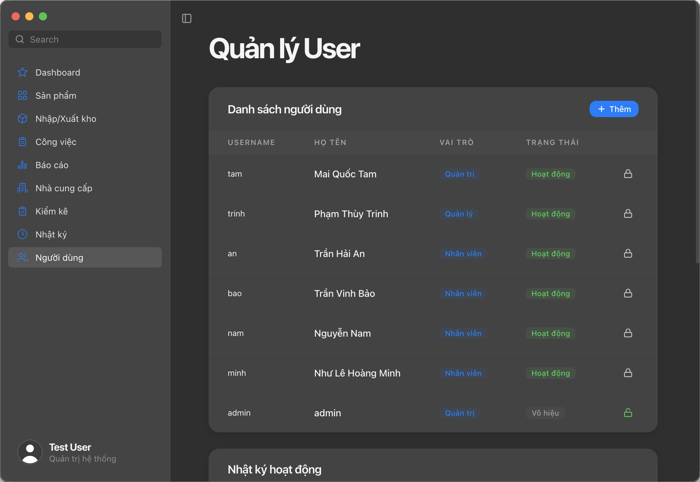
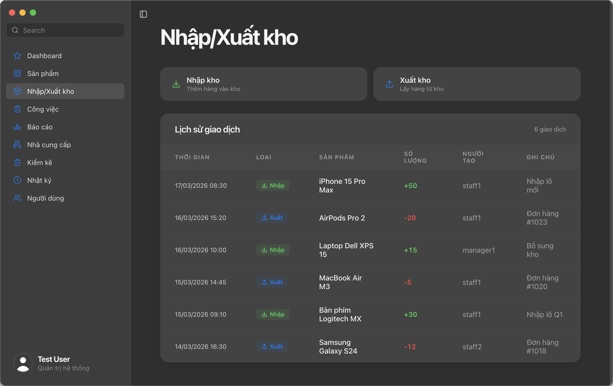
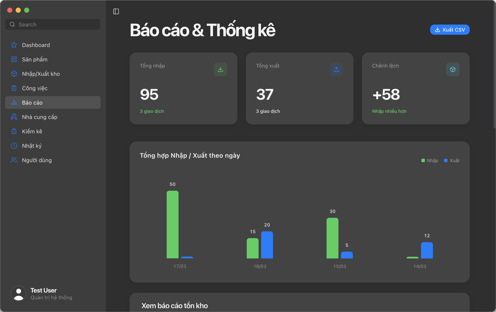
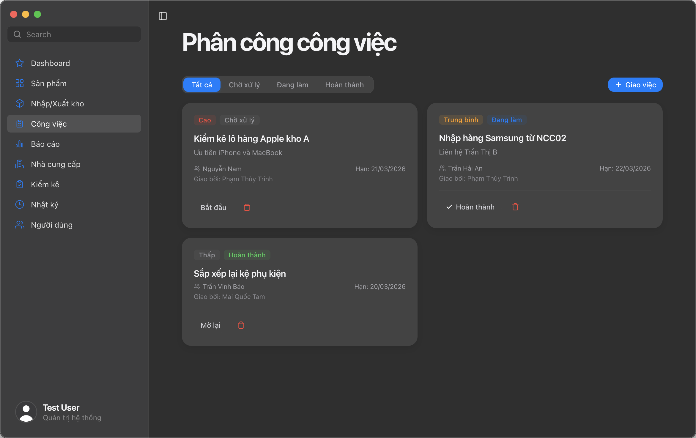
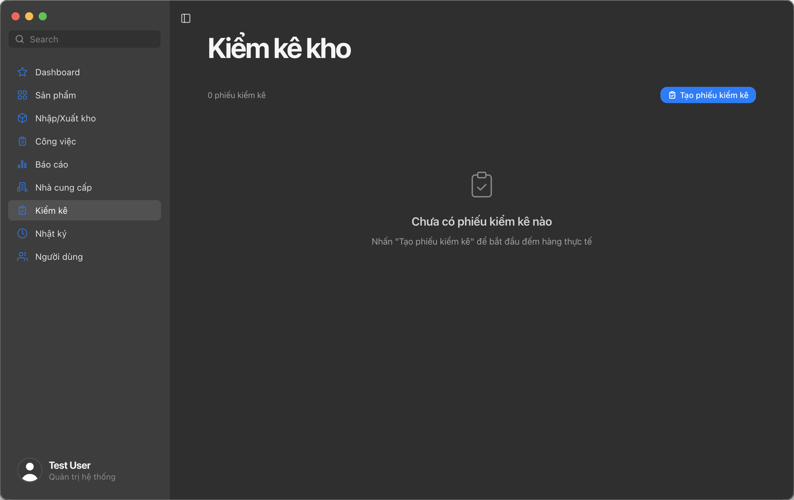
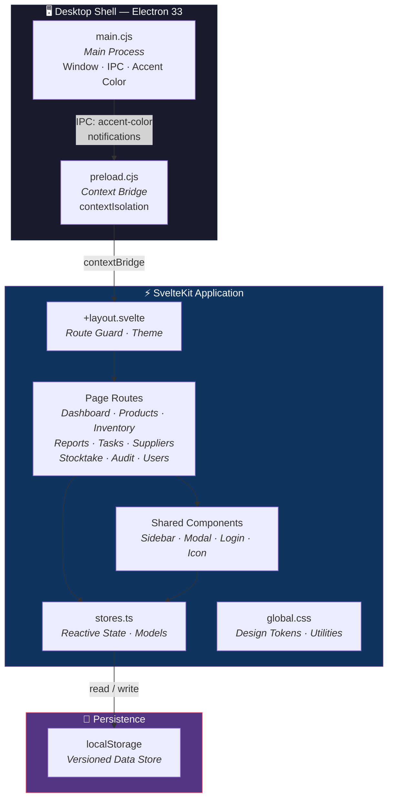
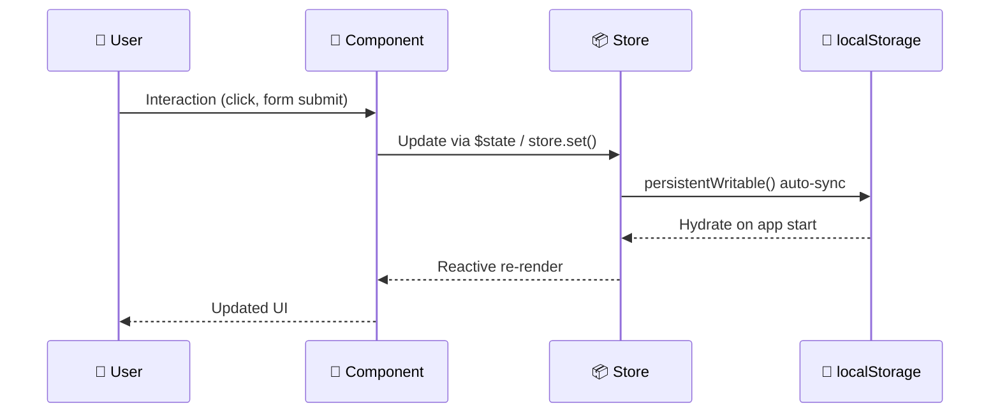

<p align="center">
  
</p>

<h1 align="center">PolyWMS</h1>

<p align="center">
  <strong>Modern, offline-first Warehouse Management System — built with SvelteKit & Electron.</strong>
</p>

<p align="center">
  <a href="https://github.com/Ic0u/PolyWMS/releases/latest">
    
  </a>
  
  
  
  
  
</p>

<p align="center">
  <a href="#key-features">Features</a> ·
  <a href="#architecture">Architecture</a> ·
  <a href="#getting-started">Getting Started</a> ·
  <a href="#contributing">Contributing</a> ·
  <a href="#roadmap">Roadmap</a>
</p>

---

## Introduction

Managing warehouse operations shouldn't require expensive enterprise software or constant internet connectivity. **PolyWMS** is a lightweight, offline-first desktop application designed for small-to-medium warehouse teams who need reliable inventory management — **no server, no cloud, no internet required**.

Built on **SvelteKit** (Svelte 5 Runes) for blazing-fast reactivity and **Electron** for native OS integration, PolyWMS runs on **macOS**, **Windows**, and **Linux** as a first-class desktop citizen. It delivers a native Apple HIG experience with translucent sidebars, dynamic OS accent color syncing, and smooth micro-animations.

### Who is this for?

| Role | What they get |
|------|---------------|
|**Staff** | Product lookup, stock-in / stock-out, and task tracking |
|**Managers** | Real-time dashboards, reporting with CSV/Excel export, and task assignment |
|**Administrators** | Full user management, audit logs, and role-based access control |

---

## Key Features

<table>
  <tr>
    <td width="50%">
      <h3>Role-Based Access Control</h3>
      <p>Three distinct roles — <strong>Admin</strong>, <strong>Manager</strong>, <strong>Staff</strong> — with granular route-level guards. Unauthorized navigation is automatically redirected.</p>
    </td>
    <td width="50%">
      <h3>Inventory Management</h3>
      <p>Complete stock-in / stock-out workflows with real-time quantity tracking. Every transaction is timestamped and attributed to the performing user.</p>
    </td>
  </tr>
  <tr>
    <td>
      
    </td>
    <td>
      
    </td>
  </tr>
  <tr>
    <td width="50%">
      <h3>Reports & Analytics</h3>
      <p>Interactive bar charts showing import/export trends. Filter by date range, type, or product. Export everything to <strong>CSV</strong> or <strong>Excel (.xlsx)</strong> with one click.</p>
    </td>
    <td width="50%">
      <h3>Task Assignment</h3>
      <p>Managers can assign, prioritize, and track tasks for warehouse staff. Tasks flow through <code>Pending → In Progress → Done</code> with full audit trails.</p>
    </td>
  </tr>
  <tr>
    <td>
      
    </td>
    <td>
      
    </td>
  </tr>
</table>

### More Highlights

- **Stocktake** — Periodic physical inventory counts with automatic discrepancy detection between recorded and actual stock levels.



- **Audit Trail** — Dual-purpose logging system capturing both administrative actions and warehouse transactions.


- **Offline Database** — All data persists locally via `localStorage` with a versioned migration system. Zero server setup.
- **macOS Tahoe Glass UI** — Frosted liquid glass modals, native vibrancy, and dynamic accent color syncing in real-time.
- **Low Stock Alerts** — Dashboard highlights items below their minimum reorder threshold.
- **Barcode Scanner Support** — Hardware barcode scanner integration with automatic input detection.

---

## Architecture

### System Overview



### Data Flow



### Tech Stack

| Layer | Technology | Purpose |
|-------|-----------|---------|
| **UI Framework** | SvelteKit + Svelte 5 Runes | Fine-grained reactivity with `$state`, `$derived`, `$effect` |
| **Desktop Runtime** | Electron 33 | Native window management, OS integration, vibrancy |
| **Build Tool** | Vite 7 | Lightning-fast HMR and static builds |
| **Styling** | Vanilla CSS | Custom Apple HIG design system — no frameworks |
| **Type Safety** | TypeScript 5 | End-to-end type coverage |
| **Data Layer** | localStorage | Offline-first persistent state via `persistentWritable` |
| **CI/CD** | GitHub Actions | Automated cross-platform builds triggered on git tags |
| **Packaging** | electron-builder | DMG (macOS), NSIS (Windows), AppImage/deb/rpm (Linux) |

---

## Getting Started

### Prerequisites

| Tool | Version | Link |
|------|---------|------|
| **Node.js** | ≥ 18.x | [nodejs.org](https://nodejs.org/) |
| **npm** | ≥ 9.x | Bundled with Node.js |
| **Git** | Latest | [git-scm.com](https://git-scm.com/) |

### Installation

```bash
# Clone the repository
git clone git@github.com:Ic0u/PolyWMS.git
cd PolyWMS

# Install dependencies
npm install
```

### Running the Project

PolyWMS supports three development modes:

#### 🌐 Browser Mode — Web Development

```bash
npm run dev
```

Opens at [`http://localhost:5173`](http://localhost:5173). Best for rapid UI iteration with Vite HMR.

#### 🖥️ Desktop Mode — Electron

```bash
npm run electron
```

Launches the full native desktop experience. Vite dev server starts first, then Electron connects automatically.

#### 📦 Production Build

```bash
# Build static assets
npm run build

# Build distributable packages for all platforms
npm run electron:build

# Or build for a specific platform
npx electron-builder --mac        # → .dmg + .zip
npx electron-builder --win        # → .exe (NSIS installer)
npx electron-builder --linux      # → .AppImage, .deb, .rpm
```

### Type Checking

```bash
# One-time check
npm run check

# Watch mode (re-checks on file changes)
npm run check:watch
```

### Available Scripts

| Script | Description |
|--------|-------------|
| `npm run dev` | Start Vite dev server at `:5173` |
| `npm run build` | Build static SvelteKit site |
| `npm run preview` | Preview production build locally |
| `npm run electron` | Launch Electron with HMR dev server |
| `npm run electron:build` | Package desktop app for all platforms |
| `npm run check` | Run `svelte-check` type validation |
| `npm run check:watch` | Run `svelte-check` in watch mode |

---

## Environment Configuration

PolyWMS is designed to work **out of the box** with zero configuration. All data is stored locally in the browser's `localStorage`.

| Variable | Default | Description |
|----------|---------|-------------|
| `STORE_VERSION` | `'5'` | Internal schema version for localStorage migrations. Incrementing this resets persisted data. |

> [!NOTE]
> Environment variables (`.env`) are not required for local development. The `.env` file is gitignored for future use cases such as Supabase/Firebase integration.

### Electron Build Config

The Electron packaging configuration is defined in `package.json` under the `"build"` key:

```jsonc
{
  "build": {
    "appId": "com.poly.app",
    "productName": "PolyWMS",
    "publish": {
      "provider": "github",
      "owner": "Ic0u",
      "repo": "PolyWMS"
    },
    "mac":   { "target": ["dmg", "zip"] },   // x64 + arm64 + universal
    "win":   { "target": ["nsis"] },          // x64 + arm64 + ia32
    "linux": { "target": ["AppImage", "deb", "rpm"] }  // x64 + arm64
  }
}
```

### CI/CD — Automated Releases

Pushing a version tag triggers the **GitHub Actions** release pipeline:

```bash
git tag v1.1.0
git push origin v1.1.0
# → Automatically builds for macOS, Windows, and Linux
# → Publishes to GitHub Releases
```

The workflow builds on `macos-latest`, `windows-latest`, and `ubuntu-latest` runners in parallel. See [`.github/workflows/release.yml`](.github/workflows/release.yml) for details.

---

## Folder Structure

```text
PolyWMS/
├── .github/
│   └── workflows/
│       └── release.yml               # CI/CD: Build & publish on git tag push
│
├── docs/                              # 📚 Project documentation
│   ├── screenshots/                   #   App screenshots for README
│   ├── BACKLOG_COVERAGE.md            #   Agile backlog audit report
│   ├── PRODUCT_BACKLOG.md             #   Prioritized product backlog
│   ├── PPS_ESTIMATION.md              #   Effort estimation document
│   ├── PROJECT_REVIEW_260321.md       #   Technical review
│   └── RELEASE_BACKLOG.md             #   Release-scoped backlog
│
├── electron/                          # 🖥️ Electron main process
│   ├── main.cjs                       #   Window creation, IPC, accent color, app:// protocol
│   └── preload.cjs                    #   Secure context bridge (contextIsolation)
│
├── src/
│   ├── lib/
│   │   ├── components/                # 🧩 Reusable Svelte components
│   │   │   ├── Icon.svelte            #   SF Symbol-style SVG icon library
│   │   │   ├── Login.svelte           #   Authentication screen
│   │   │   ├── Modal.svelte           #   Reusable modal dialog (Tahoe Glass)
│   │   │   └── Sidebar.svelte         #   Navigation sidebar with native vibrancy
│   │   │
│   │   ├── styles/
│   │   │   └── global.css             #   Design tokens, utilities, Tahoe Glass system
│   │   │
│   │   └── stores.ts                  #   Reactive stores, data models, persistence layer
│   │
│   ├── routes/                        # 📄 SvelteKit file-based routing
│   │   ├── +layout.svelte             #   Root layout, route guard, theme provider
│   │   ├── +page.svelte               #   Dashboard (overview, stats, charts)
│   │   ├── audit/                     #   System audit log viewer
│   │   ├── inventory/                 #   Stock-in / Stock-out operations
│   │   ├── products/                  #   Product catalog (CRUD + category filter)
│   │   ├── reports/                   #   Analytics, charts, CSV/Excel export
│   │   ├── stocktake/                 #   Physical inventory counting
│   │   ├── suppliers/                 #   Supplier management
│   │   ├── tasks/                     #   Task assignment & tracking
│   │   └── users/                     #   User management (Admin only)
│   │
│   ├── app.html                       #   HTML shell
│   └── app.d.ts                       #   Global type declarations
│
├── static/                            # 🖼️ Static assets
│   ├── fonts/                         #   SF Pro Display & Text fonts
│   ├── AppIcon.png                    #   Application icon
│   └── AppLogo.png                    #   Application logo
│
├── build-resources/                   # 📦 Electron packaging resources
│   ├── icon.icns                      #   macOS app icon
│   └── icon.png                       #   Windows/Linux app icon
│
├── CHANGELOG.md                       # 📋 Version history
├── LICENSE                            # ⚖️ MIT License
├── package.json                       # 📝 Dependencies, scripts & build config
├── svelte.config.js                   # ⚙️ SvelteKit + adapter-static
├── tsconfig.json                      # ⚙️ TypeScript configuration
└── vite.config.ts                     # ⚙️ Vite build configuration
```

---

## Contributing

We welcome contributions from everyone! Whether it's a bug fix, new feature, or documentation improvement — every contribution counts.

### Quick Start

```bash
# 1. Fork & clone
git clone git@github.com:YOUR_USERNAME/PolyWMS.git
cd PolyWMS
npm install

# 2. Create a feature branch
git checkout -b feature/your-feature-name

# 3. Start developing
npm run dev        # Browser mode
npm run electron   # Desktop mode
```

### Development Guidelines

| Area | Convention |
|------|-----------|
| **Components** | Place in `src/lib/components/`. Use Svelte 5 Runes (`$state`, `$derived`, `$effect`). |
| **Styling** | Use CSS custom properties from `global.css`. No inline styles, no CSS frameworks. |
| **State** | Add persistent stores via `persistentWritable()` in `stores.ts`. Bump `STORE_VERSION` on schema changes. |
| **Icons** | Add to `Icon.svelte` following the SF Symbol SVG pattern. |
| **Types** | Define interfaces/types in `stores.ts` alongside their store definitions. |

### Commit Convention

We follow [Conventional Commits](https://www.conventionalcommits.org/):

```text
feat: add barcode scanning support
fix: resolve inventory count mismatch
docs: update API documentation
style: adjust sidebar spacing
refactor: extract validation logic
chore: bump Svelte to v5.52
```

### Pull Request Checklist

- [ ] Branch created from `main`
- [ ] Code follows existing patterns and conventions
- [ ] `npm run check` passes with no errors
- [ ] Screenshots included for any UI changes
- [ ] Clear description of what and why

---

## Roadmap

### ✅ v1.0 — Foundation `Shipped`

- [x] Role-based authentication (Admin / Manager / Staff)
- [x] Product catalog with category filtering
- [x] Stock-in / Stock-out workflows
- [x] Real-time dashboard with statistics
- [x] Reports with date filtering and CSV export
- [x] Task assignment and tracking
- [x] Stocktake with discrepancy detection
- [x] System audit logging
- [x] Supplier management
- [x] Apple HIG design system with OS accent sync

### ✅ v1.1 — Polish `Shipped`

- [x] Rebranding: Opus WMS → Poly WMS
- [x] macOS Tahoe Glass modal effects (frosted liquid glass)
- [x] Dynamic accent color syncing with macOS System Preferences
- [x] Light Mode overhaul (Apple App Store aesthetic)
- [x] True sidebar vibrancy with native Electron underlay
- [x] Export to Excel (.xlsx)
- [x] Bulk status update for inventory items
- [x] Low stock alerts on dashboard
- [x] Initial barcode scanner integration
- [x] Refined login UI with floating dashboard card

### 🔮 v2.0 — Connected `Planned`

- [ ] **Cloud Database** — Supabase/Firebase integration for multi-device sync
- [ ] **Approval Workflows** — Maker/Checker pattern for stock operations
- [ ] **Barcode/QR Scanner** — Camera and USB scanner support for rapid stock entry
- [ ] **PDF Export** — Generate printable A4 stock-in/stock-out receipts
- [ ] **Multi-Warehouse** — Support for multiple warehouse locations with inter-warehouse transfers
- [ ] **Notifications** — Push notifications for low stock alerts and task deadlines

---

## License

This project is licensed under the **MIT License** — see the [LICENSE](LICENSE) file for details.

```text
MIT License · Copyright (c) 2026 Nguyễn Nam
```

---

<p align="center">
  Built with ❤️ using <strong>SvelteKit</strong> + <strong>Electron</strong>
  <br/>
  <sub>Designed with Apple Human Interface Guidelines inspiration</sub>
</p>
